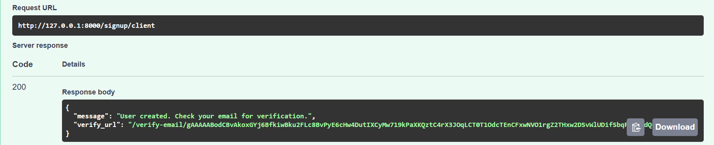
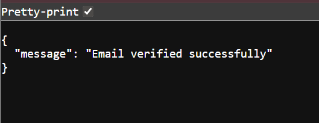
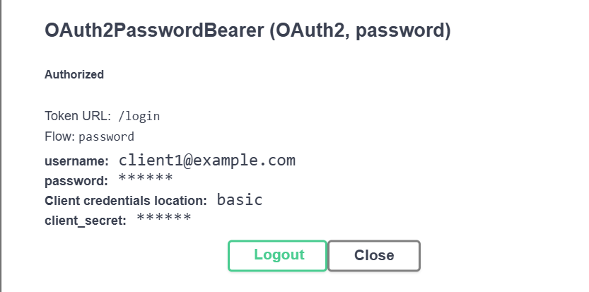
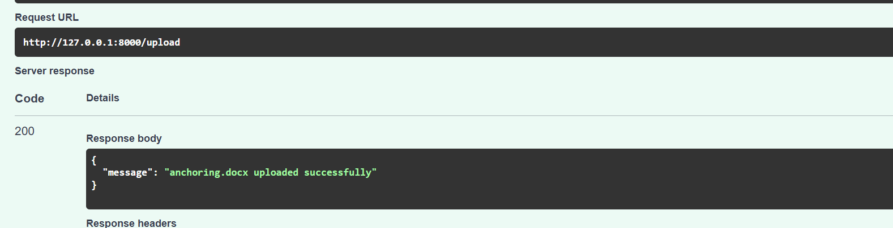
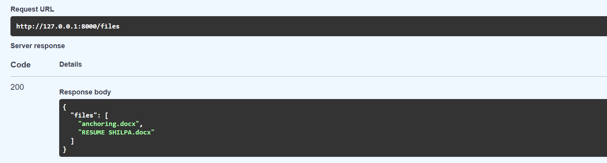
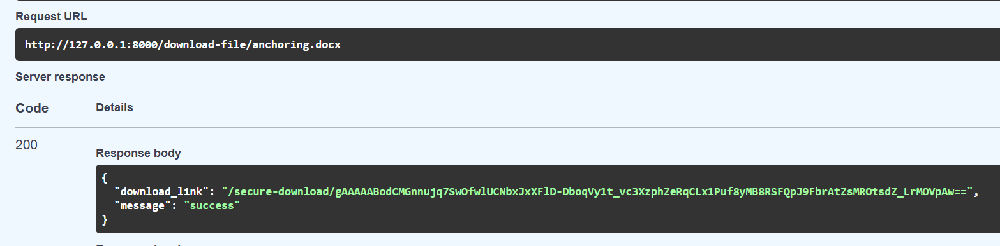
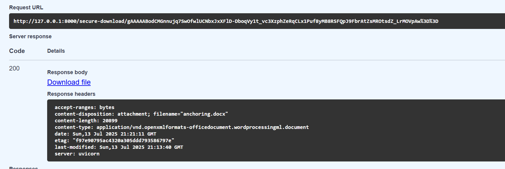

# 🔐 Secure File Sharing System — FastAPI Based

This is a beginner-friendly full-stack FastAPI project that demonstrates how to securely share files between two different user types — **Ops Users** and **Client Users** — with email verification, JWT authentication, encrypted download URLs, and role-based access control.

---

##  Features

- ✅ Client User Sign-up with mock email verification
- ✅ JWT-based login for both Ops & Client users
- ✅ Role-based access:
  - **Only Ops** can upload files (.docx, .pptx, .xlsx)
  - **Only Clients** can list/download files via secure links
- ✅ Encrypted download URLs (Fernet) that restrict access by role
- ✅ Postman collection for testing
- ✅ Beginner-friendly codebase with clean folder structure

---

## 🧠 Tech Stack

- **Framework**: FastAPI
- **Auth**: OAuth2 + JWT tokens
- **Encryption**: `cryptography.fernet`
- **Data**: In-memory DB (for demo)
- **Test Tool**: Postman
- **Lang**: Python 3.10+

---

## 🧭 How This Website Works – The Full Flow

### 🔵 Step 1: Client Signs Up  
- Calls `POST /signup/client`  
- Gets an encrypted mock email verification link in the terminal  

📷 

---

### 🟢 Step 2: Email Verification  
- Visits `/verify-email/{token}`  
- Email is decrypted and marked as verified  

📷 

---

### 🟠 Step 3: Client Logs In  
- Uses `/login` with form-data: `username`, `password`  
- Receives JWT token  

📷 

---

### 🔴 Step 4: Ops Logs In  
- Ops user logs in (`ops1@example.com`) via `/login`  
- Gets a token used for file upload access

---

### 🟣 Step 5: Ops Uploads File  
- Sends `POST /upload` with `.docx`, `.pptx`, `.xlsx`  
- Saved in `/uploads/`

📷 

---

### 🟤 Step 6: Client Lists Files  
- Sends `GET /files`  
- Returns list of uploaded files  

📷 

---

### ⚪ Step 7: Client Generates Download Link  
- Sends `GET /download-file/{filename}`  
- Gets encrypted download link  

📷 

---

### 🟡 Step 8: Client Downloads File  
- Sends `GET /secure-download/{token}`  
- Only works for verified client users  

📷 

---

### 🎯 Role Access Summary

| Action               | Client ✅ | Ops ✅ |
|----------------------|-----------|--------|
| Sign Up              | ✅         | ❌     |
| Email Verify         | ✅         | ❌     |
| Login                | ✅         | ✅     |
| Upload File          | ❌         | ✅     |
| List Files           | ✅         | ❌     |
| Get Download Link    | ✅         | ❌     |
| Use Download Link    | ✅         | ❌     |

---

## 🧪 Testing With Postman

Import this file into Postman:

📦 [`secure-file.postman_collection.json`](./secure-file.postman_collection.json)

Each endpoint has:
- Method
- Headers (use Bearer token for `/files` and `/upload`)
- Sample payload

---

🔐 Sample Users

Ops	-> client1@example.com	-> abc123

Client	-> client2@example.com	-> abcabc

